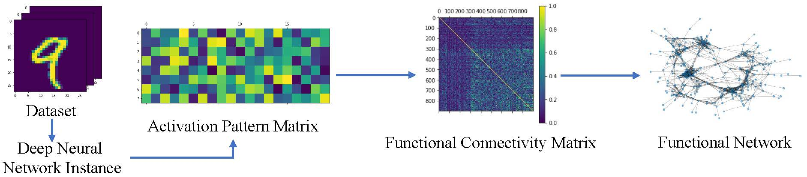

# DNN
# Functional Network: A Novel Framework for Interpretability of Deep Neural Networks
This is an implementation of functional network for the deep neural network on Python3.

## 0. Requirements

igraph=0.9.11, giotto-tda=0.5.0, PyTorch=1.10.0 or newer, numpy, scikit-learn, scipy

## 1. Import the dataset and train neural networks
MNIST, Fashion-MNIST and CIFAR-10 datasets can be downloaded in `./data` via pytorch.

Train the FCN.
`python ./src/FCN.py` 

The trained FCN model and its cor matrix files are in `./results/`.

## 2. Construct the graph model of the functional network

`python ./src/GTA_Experiments.py` to construct the graph models for GTA

## 3. Construct the simplicial complex model of the functional network

`python ./src/TDA_Experiments.py` to construct the simplicial complex models
and compute their persistence diagrams for TDA
